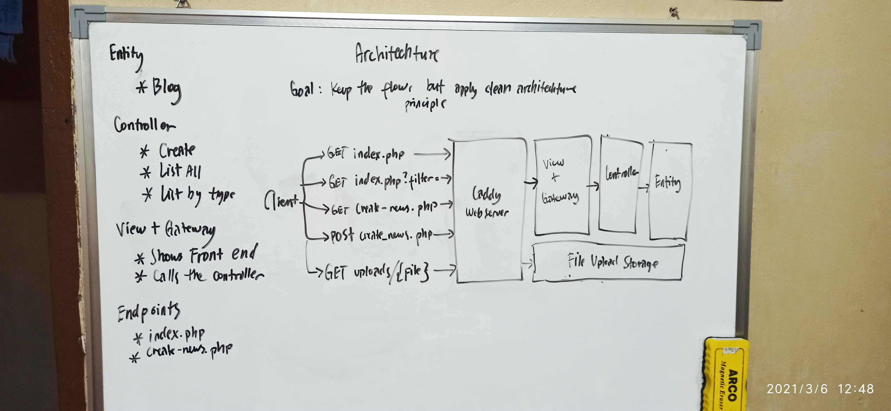

# mDAOnmH - Better

This thing is  fully  refactored.  The  endpoints  `index.php`  and  `create-news.php`  is
retained but code wise, a lot of thing has changed. I wrote full test case  for  `entity`.
And I did not use any framework such as PHPUnit.  This  whole  thing  is  so  lightweight.
There's    no    *composer*,    just    bare    PHP.    I'm    quite    surprised     that
[writing a test framework](src/tests/test.php) would never be so simple. Maybe because I  just  have
few things that I need to get my test done, but it does the job.

## Done reading?

* [<< Go back to secure](../secure)

## Changes

* Separated things into: `domain`, `driver`, `tests`, and `view`.
* For security, we create `public` folder where the only php files we want to be  seen  by
  the world is placed there. The php files there serves as our endpoint. The rest  are  at
  the back of public.
* `entity` is fully tested (the database part). I did not test the other parts  because  I
  got in a hurry and I wish to release this asap now.

## Things that I'd like to brag

Our entrypoints are `index.php` and `create-news.php`. It has the flow  that  is  just  as
same as *unsecure* and *secure* version, but the code is fully different.  It  feels  like
you've used a framework when you dig deeper. My code follows a certain format that I  have
created.

The `index.php` is just so small, same goes with `create-news.php`.

``` php
<?php

require(__DIR__ . '/../router.php');
require(__DIR__ . '/../domain/gateway.php');

route('GET', ['filter'], 'gateway_blog_list_by_type');
route('GET', [], 'gateway_blog_list_all');
```

**It all begins on router.**

Client --> Router --> Gateway --> Controller --> Entity --> MariaDB

The flow above is quite similar to the image that I created below.



## Thoughts

I think I'm going to revise this image to make the service diagram more accurate.  My  new
core philosophy when I'm writing code is  to  make  sure  that  I'm  writing  things  that
reflects the business case / requirements. I'll begin by visualizing the entire big  thing
and write a diagram on my whiteboard. Then second is I'll start writing a high level  test
that tests the behavior, not the implementation.

## Issues

`Write issue that you spotted here...`
